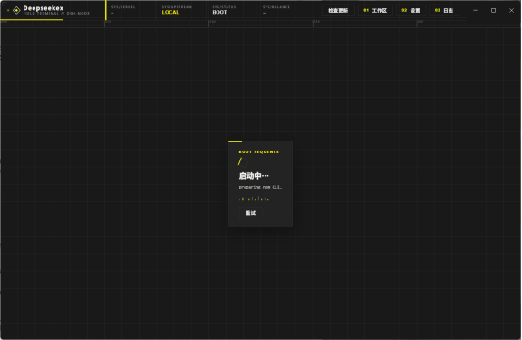
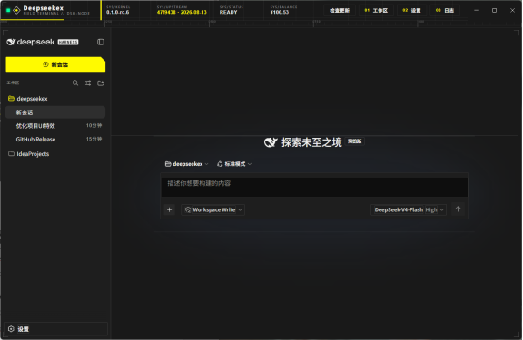

# Deepseekex ⬢

> **《明日方舟：终末地》（Endfield）视觉风格的 [DeepSeek Harness](https://github.com/deepseek-ai/deepseek-harness) 桌面客户端** ——
> Electron 稳定壳 + 可热更新的内核，Windows / macOS 双平台。

[](https://github.com/ianfog/deepseekex/releases)
[](https://github.com/ianfog/deepseekex/releases)
[](https://www.npmjs.com/package/@deepseek-ai/dsh)

---

## 特性一览

- 🎨 **终末地视觉语言** —— 炭墨 `#191919` 基底、荧光黄 `#fffa00` 唯一信号色、切角楔形按钮、校准刻度尺、四角定位框；dsh 内核界面整体换皮（~90 个设计令牌重定义），不只是壳。
- 🔄 **内核热更新** —— 从 npm 官方渠道（上游 GitHub 源码的发布产物）下载新内核，验证通过后原子切换并重启，一键升级；旧内核保留用于回滚，壳层永不失效。
- 🛡️ **崩溃自愈** —— 内核进程异常退出自动重启，连续崩溃自动回滚到上一个可用版本。
- 📊 **余额遥测** —— 顶栏 `SYS/BALANCE` 实时展示 DeepSeek 平台余额，低余额危险红提示。
- 🔑 **密钥安全** —— API Key 仅主进程从本地凭据文件读取，不进日志、不进渲染层。

## 截图

<table>
  <tr>
    <td align="center"></td>
    <td align="center"></td>
  </tr>
  <tr>
    <td align="center">主界面（壳顶栏 + 内核 Web 界面）</td>
    <td align="center">设置 / 更新面板</td>
  </tr>
</table>

## 设计语言（终末地 / Endfield）

> 灵感来自《明日方舟：终末地》的"现场工程系统"视觉语言（`endfield` 风格族 · 复杂档），全程贯彻：
> 炭墨 `#191919` 基底 + 米白 `#f2f2f0` 文本 + 荧光黄 `#fffa00` **唯一信号色** + 在线绿 `#00ffa2`
> （仅在线 / 已验证态）+ 切角楔形按钮 + 校准刻度尺 + 四角定位框 + 大号编号 + 1px 发丝线。

- **配色**（跟随系统 / 浅色 / 深色）：dsh UI 自带（设置 → 常规 → 外观），写在热重载设置文档
  `$DSH_HOME/settings.yaml` 的 `ui-theme.preference`，即时生效；壳层读取同一偏好决定是否强制
  深色补丁（非显式浅色即 Endfield 炭墨壳）。右上角壳设置不含配色项，避免双入口。
- **动效**：顶栏信号轨黄色擦入、状态块呼吸、菱形旋转加载；`prefers-reduced-motion` 下全部关闭。
- **内核 UI 补丁层**（`main/ui-patch.js`）：dsh 界面本身也按 Endfield 语言重定义设计令牌——
  覆盖全部 ~90 个 `--dsw-*` 别名（底色分层、发丝线边框、文字、品牌、按钮、交互态、成功/警告/
  错误状态、侧栏、气泡、菜单、输入、markdown、滚动条、字体），深浅两套色板随主题属性热切换；
  组件细节（荧光黄选区、方形滚动条、输入框荧光黄焦点、新建会话切角 CTA、侧栏发丝线、触发控件
  信号左轨、工作区悬停信号轨、方形面板/气泡）按真实 CSS-module 类名后缀命中（如 `*_newSession`、
  `*_composerSeat`、`*_sidebarCol`）。补丁在 iframe 每次加载完成后由壳自动注入
  （`did-frame-finish-load`），**不修改内核文件，内核更新后自动重放，永不失效**。扩展方式：
  往 `buildUiPatchCss()` 里加令牌/规则即可。验证：`npx electron main/verify-endfield.js`
  起私有内核并截图/读计算样式（`main/probe-live-dom.js` 可单独导出 DOM 类名清单）。

## 架构

```
Deepseekex (Electron 壳 — 稳定层)
├─ 主进程
│  ├─ 内核管理器  版本化内核目录 + 原子切换 + 回滚
│  ├─ 后端启动器  spawn 内核 (dsh web --port 0) → 探测 /probe → 窗口加载
│  ├─ 内核更新器  npm registry latest（上游 GitHub 源码的官方发布渠道）
│  └─ 壳更新器    electron-updater ← GitHub Releases（ianfog/deepseekex）
├─ 内核 (可更新层)  <userData>/kernels/<version>/  ← npm install @deepseek-ai/dsh
└─ 数据/配置      默认共享 ~/.dsh（可通过设置改 DSH_HOME）
```

- 前端无需单独打包：`dsh-web-app` 的依赖链自带 `dsh-web-frontend` 编译产物，后端自己 serve。
- 无需捆绑 Node：用 `ELECTRON_RUN_AS_NODE=1` 让 Electron 自带的 Node（43.x → Node 24）直接跑内核。
- 更新即"换内核"：下载安装新版 `@deepseek-ai/dsh`（npm 是上游 GitHub 源码的官方发布渠道），
  启动验证通过后原子切换 active 指针并重启后端；旧内核保留用于回滚。
- 壳自更新：`main/shell-updater.js` 用 electron-updater 检查 GitHub Releases 的 `latest.yml`
  （`build.publish` 配置，NSIS 目标自动生成），顶栏按钮优先显示壳更新（`更新壳到 vX`），
  下载进度复用进度条，下载完成后一键重启安装；开发模式（无 app-update.yml）自动降级为
  `{ok:false}` 不抛错。
- 崩溃自愈：内核进程异常退出自动重启，连续崩溃自动回滚到上一个内核版本。

## 内核更新

- 启动时自动检查（可在设置关闭），有新版时顶栏出现"更新到 vX"按钮，一键更新后自动重启。
- 更新源 = npm registry 的 `@deepseek-ai/dsh` `latest` dist-tag，即 deepseek-ai/deepseek-harness
  源码的官方构建产物；顶栏同时展示上游 master 提交 hash。
- 未来内核版本无需改壳：版本化目录 + `active.json` 原子切换 + 启动验证 + 崩溃回滚 + 保留 3 版
  自动清理，全部按 semver 处理；npm CLI 由应用自带引导（纯 JS，Electron-as-Node 直接运行），
  打包后的 exe 首次运行会自举 npm 并安装最新内核。

## 顶栏遥测与密钥安全

- **余额遥测**：`SYS/BALANCE` 格展示 DeepSeek 平台余额（`main/balance.js` 读取
  `$DSH_HOME/.credentials.yaml` 的 `DEEPSEEK_API_KEY`，调官方 `/user/balance` 接口；
  key 仅主进程使用，不进日志/渲染层）。点击该格可手动刷新，每 5 分钟自动刷新；
  低余额/不可用显示危险红。
- **更新进度**：检查更新按钮左侧的进度条（`desktop:progress` 事件）展示
  检查/更新内核的实时进度。

## 开发 / 运行

```sh
npm install
npm start          # 启动 GUI（Windows / macOS）
npm run smoke      # 无头端到端验证（真实安装内核 + 启动后端 + 探测 + 检查更新）
```

冒烟测试使用隔离的 `DSH_DESKTOP_USERDATA`（默认 `%TEMP%/deepseekex-smoke`）与隔离的 DSH_HOME，
不影响真实数据。可用环境变量覆盖：`DSH_DESKTOP_USERDATA`、`DSH_DESKTOP_SMOKE_HOME`、
`DSH_DESKTOP_NPM_REGISTRY`。

## 打包发布

```sh
npm run dist:win   # 在 Windows 上构建 NSIS 安装包
npm run dist:mac   # 在 macOS 上构建 dmg + zip（需在 macOS 上执行）
```

- electron-builder 首次构建会从 GitHub 下载 electron 与工具链（winCodeSign/rcedit/NSIS），
  之后全部走本地缓存（`%LOCALAPPDATA%\electron-builder\Cache`）。若下载超时：
  - 有代理时先设 `HTTPS_PROXY=http://127.0.0.1:7890`（electron-builder 不读系统代理，
    只认环境变量），再 `npm run dist:win`；
  - 或设 `ELECTRON_BUILDER_BINARIES_MIRROR=https://npmmirror.com/mirrors/electron-builder-binaries/`；
  - 也可手动下载缺失的 zip 放进缓存目录（rcedit 等，文件名即 release 名）。
- 打包验证：`dist/win-unpacked/Deepseekex.exe` 即完整应用；若 dev 实例正在运行，
  用 `--user-data-dir=<临时目录>` 避开单实例锁再启动。打包后的 exe 首次运行会自举
  npm CLI 并安装最新内核（联网）；也可把已装内核复制进
  `%DSH_DESKTOP_USERDATA%/kernels/` 并写 `active.json` 离线验证。
- 正式发布 Windows 需代码签名（避免 SmartScreen 提示）；macOS 需 Apple Developer 证书
  签名 + 公证（Gatekeeper），当前 `electron-builder` 配置为未签名构建，供内部试用。
- 应用图标：`build/icon.ico` 已由 `node scripts/make-icon.js` 生成（Endfield 风格菱形标，
  16–256 多尺寸，纯 Node 编码无外部依赖），打包时自动使用；macOS 的 `icon.icns` 需另行生成。
- 三平台发布建议配 GitHub Actions 矩阵，各平台原生构建（macOS 的 dmg 必须在 macOS 上构建）。

## 目录

```
main/          主进程（index/kernel/backend/updater/npm/net/tar-extract/paths/log/smoke）
preload.js     渲染层桥接
renderer/      壳页面（顶栏、webview、更新 UI、设置、日志）
```
